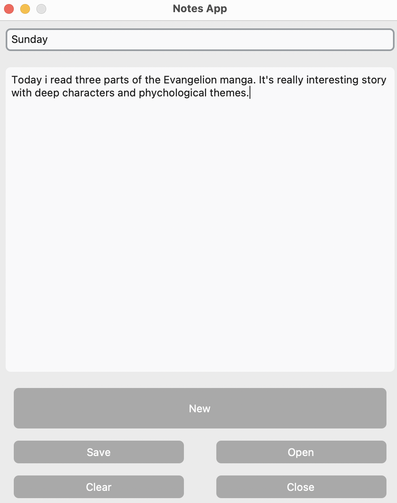

# 📝 Notes App

A simple and modern Notes App built using `Tkinter` and `CustomTkinter`.

## 🚀 Features

- 🆕 **Create New Notes**
- 💾 **Save Notes**
- 📂 **Open Existing Notes**
- 🧹 **Clear Text Area**
- ❌ **Close with Auto-Save**

## 📦 Installation

1. Clone the repository:

   ```sh
   git clone https://github.com/Ramin2009Mc/Notes_App.git
   cd notes-app
   ```

2. Install dependencies:

   ```sh
   pip install customtkinter
   ```

3. Run the application:

   ```sh
   python app.py
   ```

## 🖥️ Usage

- Enter a title for your note.
- Write your content in the text area.
- Use the buttons to save, open, clear, or create a new note.
- Clicking "Close" will automatically save the current note before exiting.

## 📸 Screenshots



Made with ❤️ by Ramin

